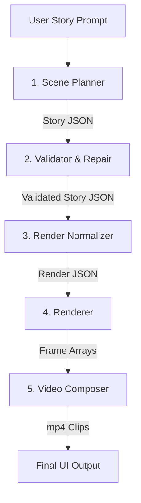

# Text-to-Video Pipeline Architecture

The Text-to-Video (T2V) generator inside the local UI follows a highly constrained, deterministic pipeline. Rather than feeding raw Large Language Model (LLM) text directly into a video generation model, this pipeline treats the LLM as a **Scene Planner** that produces structured JSON, which is then explicitly parsed and rendered frame-by-frame by a deterministic Python drawing engine.

This approach ensures hardware efficiency (no diffusion models required) and predictable stylistic output (concept/storyboard aesthetics).

## 1. High-Level Flow

The pipeline executes in 5 distinct layers:



### 1. Scene Planner (`scene_planner.py`)
- **Engine**: Local Ollama (default: `gemma4:e4b`).
- **Goal**: Read the user prompt and extract a high-level narrative intent.
- **Constraints**: The LLM is provided a strict set of allowed background strings, object strings, and motion strings (defined in `scene_schema.py`). It must output pure JSON using these constraints.

### 2. Validator & Repair (`scene_validator.py`)
- **Engine**: Python dictionary logic and fuzzy matching (`difflib`).
- **Goal**: Ensure the LLMs JSON output is safe for the renderer.
- **Action**: It aggressively coerces unknown string values into the nearest allowed enum value from `scene_schema.py`. It also clamps durations between 3 and 5 seconds to prevent memory overflow during rendering.

### 3. Render Normalizer (`render_normalizer.py`)
- **Engine**: Scripted template mapping.
- **Goal**: Bridge the gap between narrative intent (Story JSON) and explicit drawing instructions (Render JSON).
- **Action**:
    1. **Template Matching**: Maps the scene's action keywords to a static blueprint in `scene_templates.py` (e.g., `wake_up`, `cleaning`, `sports`).
    2. **Coordinate Assignment**: Replaces vague locations with hard `(x,y)` coordinates based on the template layout.
    3. **Beat Generation**: Converts the `intended_motion` list into array of "Timings and Beats" (e.g., At 0.0s be idle, at 3.0s bend down).

### 4. Renderer (`renderer.py`)
- **Engine**: Python Imaging Library (`Pillow`).
- **Goal**: Convert Render JSON into sequential image frames using a beat-driven state machine.
- **Action**: It parses the active `background` and draws vector-like shapes for the `objects` and `characters`. As it creates each frame, it calculates the current `anim_t` and linearly interpolates character leg/arm angles between the defined `beats` to create fluid geometric motion.

### 5. Video Composer (`video_composer.py`)
- **Engine**: `moviepy`.
- **Goal**: Convert frames to `.mp4` and sequence scenes.
- **Action**: Encodes individual scene clips for UI preview capabilities, and then concatenates all clips together using `libx264` codec.

## 2. Core Concepts & Data Structures

### The Two-Schema Approach
The biggest architectural decision is isolating **Story JSON** from **Render JSON**.

#### Story JSON (Generated by LLM)
Focuses on narrative.
```json
{
  "background": "charging_room",
  "action_summary": "robot walks to charger",
  "key_objects": ["charging_station"],
  "intended_motion": ["walk_right", "plug_in"]
}
```

#### Render JSON (Generated by Normalizer)
Focuses on exact visual state.
```json
{
  "background": "charging_room",
  "objects": [
    {"type": "charging_station", "position": {"x": 460, "y": 500}}
  ],
  "beats": [
    {"time_pct": 0.0, "pose": "walk_right", "target_x": 420},
    {"time_pct": 0.5, "pose": "plug_in"}
  ]
}
```

## 3. Extending the Visuals

If you wish to add new visual capabilities, you must touch the stack top-to-bottom:

1. **`scene_schema.py`**: Add the new string key (e.g., `ALLOWED_OBJECTS.append("laptop")`).
2. **`scene_templates.py`**: (Optional) incorporate the element as a default in a new or existing template layout.
3. **`renderer.py`**: Add the specific drawing logic (e.g., add `elif obj_type == "laptop": draw.rectangle(...)` inside `_draw_object()`).
